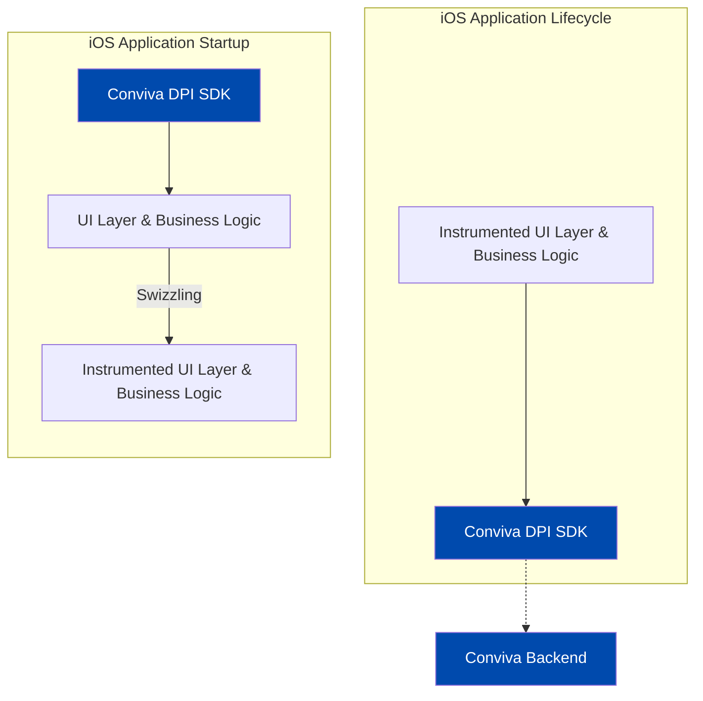

# Conviva iOS DPI SDK - Developer Integration Guide

Use Conviva iOS DPI SDK to auto-collect events and track application-specific events and state changes.

**Table of Contents**
- [Quick Start](#quick-start)
- [More Features](#more-features)
- [Auto-collected Events](#auto-collected-events)
- [FAQ](#faq)

## Quick Start

##### Supported Platforms

* iOS (12.0 and above)
* iPadOS (13.0 and above)
* tvOS (12.0 and above)
* watchOS (TBD)

<details>
<summary><b>Diagram</b></summary>



</details>
  

### 1. Installation

- Install the Conviva iOS DPI SDK using one of the following methods:
 
    <!--self-serve[SPM]-->

    - **Swift Package Manager**
        - In **Xcode**, navigate to:  
             `File` → `Add Package Dependency...`
        - Add the following repository URL:  
             `https://github.com/conviva/conviva-ios-appanalytics`


    <!--eof-self-serve--> 

    <!--self-serve[CocoaPods]-->

    - **CocoaPods**

       - Add the following line to your `Podfile`, replacing `<version>` with the latest version: [](https://github.com/Conviva/conviva-ios-appanalytics/releases)

    ```plaintext
        pod 'ConvivaAppAnalytics', '<version>'
    ```
     <!--eof-self-serve--> 


     <!--self-serve[Manual]-->

   - **Manual Install**
       - Download the package from [](https://github.com/Conviva/conviva-ios-appanalytics/releases).
       - In Xcode, go to **Build Phases** and add `ConvivaAppAnalytics.xcframework` to the **Link Binary with Libraries** section. This package contains frameworks for iOS, iPadOS and tvOS.

   <!--eof-self-serve--> 
    
    

Only for [Swift Package Manager](#swift-package-manager) and [Manual Install](#manual-install), add required frameworks and linker flags:

   <!--self-serve[SPM,Manual]-->


   -  In Xcode, navigate to **Build Phases** &#8594; **Link Binary With Libraries** and add the following system frameworks:
       -  `UIKit`
       -  `Foundation`
       -  `CoreTelephony` (iOS only)
   - In **Other Linker Flags** add `-ObjC`.
      
- Import the Conviva SDK into your source code:
<!-- :::code-tabs[Swift,ObjC] -->
```Swift
// Swift:
import ConvivaAppAnalytics
```

```ObjC
// ObjC:
@import ConvivaAppAnalytics;

```
<!-- ::: -->
   <!--eof-self-serve--> 


### 2. Initialization

> **Note:**
> It is recommended to initialize the tracker at the earliest possible stage of the application's launch lifecycle. Ideally, this should be done in the app's entry point method, before any other application functionality is executed.

Some examples of Conviva iOS DPI SDK initialization:

<details>
<summary><b>UIKit AppDelegate (Swift)</b></summary>

```Swift
import ConvivaAppAnalytics

@UIApplicationMain
class AppDelegate: UIResponder, UIApplicationDelegate {
    
    func application(
        _ application: UIApplication,
        didFinishLaunchingWithOptions launchOptions: [UIApplication.LaunchOptionsKey : Any]? = nil
    ) -> Bool {
        // Initialize Conviva Tracker.
        // Note: CATAppAnalytics.createTracker is an Objective-C method and does not throw Swift errors.
        // Log on nil and continue -- Conviva is telemetry, an init failure must not affect app launch.
        let tracker = CATAppAnalytics.createTracker(customerKey: "YOUR_CUSTOMER_KEY", appName: "YOUR_APP_NAME")
        if tracker == nil {
            print("Conviva tracker init returned nil")
        }

        return true
    }

}
```

</details>

<details>
<summary><b>UIKit AppDelegate (ObjC)</b></summary>

```ObjC
@import Foundation;          // add only if not already imported (direct, not transitive via UIKit)
@import ConvivaAppAnalytics;

@implementation AppDelegate

- (BOOL)application:(UIApplication *)application 
    didFinishLaunchingWithOptions:(NSDictionary *)launchOptions {

    // Initialize Conviva Tracker
    @try {
        id<CATTrackerController> tracker = [CATAppAnalytics createTrackerWithCustomerKey:@"YOUR_CUSTOMER_KEY" appName:@"YOUR_APP_NAME"];
        if (tracker == nil) {
            NSLog(@"Conviva tracker init returned nil");
        }
    } @catch (NSException *exception) {
        NSLog(@"Conviva tracker init failed: %@", exception);
    }

    return YES;
}
```

</details>

<details>
<summary><b>SwiftUI App</b></summary>

```Swift
import SwiftUI
import ConvivaAppAnalytics

@main
struct YourApp: App {
    init() {
        // Note: CATAppAnalytics.createTracker is an Objective-C method and does not throw Swift errors.
        // Log on nil and continue -- do not `return` early, that would skip any subsequent initialization.
        let tracker = CATAppAnalytics.createTracker(customerKey: "YOUR_CUSTOMER_KEY", appName: "YOUR_APP_NAME")
        if tracker == nil {
            print("Conviva tracker init returned nil")
        }
    }

    var body: some Scene {
        WindowGroup {
            ContentView()
        }
    }
}
```

</details>

**YOUR_CUSTOMER_KEY** - A string to identify a specific customer account. Use different keys for dev and prod. Find them in [Pulse](https://pulse.conviva.com/app/profile/applications) under My Profile (_Conviva login required_).

**YOUR_APP_NAME** -  A string value that uniquely identifies your app across platforms.

The tracker object can be retrieved using the following API in other classes after initialization.
<!-- :::code-tabs[Swift,ObjC] -->
```Swift
// Swift:
let tracker = CATAppAnalytics.defaultTracker();
```

```ObjC
// ObjC:
id<CATTrackerController> tracker = [CATAppAnalytics defaultTracker];
```
<!-- ::: -->

### 3. Set the User ID
User ID is a unique string identifier to distinguish individual viewers. If using [Conviva Video Sensor](https://github.com/Conviva/ConvivaSDK), match it with the **Viewer ID**.

> Wrap every Conviva call so AI-generated integration code cannot crash the host app: ObjC uses `@try`/`@catch (NSException *)` plus a `tracker != nil` check (and `@import Foundation;` if no direct Foundation import is already present in the file); Swift uses optional chaining for one-line calls and `if let` when building event objects.
<!-- :::code-tabs[Swift,ObjC] -->
```Swift
// Swift:
let tracker = CATAppAnalytics.defaultTracker()
tracker?.subject?.userId = "user_id"
```

```ObjC
// ObjC:
@try {
    id<CATTrackerController> tracker = [CATAppAnalytics defaultTracker];
    if (tracker != nil) {
        tracker.subject.userId = @"user_id";
    }
} @catch (NSException *exception) {
    NSLog(@"Conviva setUserId failed: %@", exception);
}
```
<!-- ::: -->

## More Features

<details>
<!--self-serve-custom-event-->
<summary><b>Track Custom Event</b></summary>

Two APIs to track custom events:

```
/**
 * Track custom event.
 * @param name Name of the custom event.
 * @param data A JSON-formatted string.
 */
- (void)trackCustomEvent:(NSString *)name data:(nonnull NSString*)data;

/**
 * Track custom event.
 * @param name Name of the custom event.
 * @param eventData Dictionary/Array of dictionaries.
 */
- (void)trackCustomEvent:(NSString *)name eventData:(nonnull id)eventData;
```

Examples:
<!-- :::code-tabs[Swift,ObjC] -->
```Swift
// Swift:
if let tracker = CATAppAnalytics.defaultTracker() {
    let eventData: [String: Any] = ["identifier1": "test", "identifier2": 1, "identifier3": true]
    tracker.trackCustomEvent("your-event-name", eventData: eventData)
}
```

```ObjC
// ObjC:
@try {
    id<CATTrackerController> tracker = [CATAppAnalytics defaultTracker];
    if (tracker != nil) {
        NSDictionary *data = @{@"identifier1": @"test", @"identifier2": @(1), @"identifier3": @(YES)};
        [tracker trackCustomEvent:@"your-event-name" eventData:data];
    }
} @catch (NSException *exception) {
    NSLog(@"Conviva trackCustomEvent failed: %@", exception);
}
```
<!-- ::: -->

<!--eof-self-serve-custom-event--> 
</details>

<details>
<!--self-serve-revenue-event-->
<summary><b>Track Revenue Event</b></summary>

Use the **trackRevenueEvent()** API to track successful purchase events. The event is sent as **conviva_revenue_event** and can be used for Business/Revenue Metrics in Conviva.

| Field              | ObjC Type    | Swift Type   | Description |
| ------------------ | ------------ | ------------ | ----------- |
| totalOrderAmount   | NSNumber     | NSNumber     | Total order amount (must be a finite number) |
| transactionId      | NSString     | String       | Unique order/transaction identifier (non-nil, non-empty after trim). If your backend uses `orderId`, pass it here. |
| currency           | NSString     | String       | Currency code, e.g. `"USD"`, `"EUR"` (non-nil, non-empty after trim) |

**Optional fields:**

| Field             | ObjC Type                             | Swift Type                       | Description |
| ----------------- | ------------------------------------- | ------------------------------- |----------- |
| taxAmount         | NSNumber                              | NSNumber                        | Tax amount |
| shippingCost      | NSNumber                              | NSNumber                        | Shipping cost |
| discount          | NSNumber                              | NSNumber                        | Discount / coupon value |
| cartSize          | NSNumber                              | NSNumber                        | Count of items in the order |
| paymentMethod     | NSString                              | String                          | e.g. `"card"`, `"ApplePay"`, `"payPal"` |
| paymentProvider   | NSString                              | String                          | e.g. `"Stripe"`, `"Adyen"` |
| items             | NSArray<CATRevenueEventItem *>        | [CATRevenueEventItem]           | Array of purchased line items. |
| extraMetadata     | NSDictionary<NSString *, id> *        | [String: Any]                   | Custom key/value pairs for fields not modeled above (merged into the payload as `extraMetadata`) |

*CATRevenueEventItem Fields:*

| Field             | ObjC Type                         | Swift Type                      | Description |
| ----------------- | --------------------------------- | ------------------------------- |----------- |
| productId         | NSString                          | String                          | Unique product identifier |
| name      		  | NSString                          | String                          | Product name |
| unitPrice         | NSNumber                          | NSNumber                        | Price per unit |
| quantity          | NSNumber                          | NSNumber                        | Number of units purchased |

**Notes:**
- If validation fails on required fields (e.g. missing `transactionId` or non-finite `totalOrderAmount`), the SDK logs a warning and skips the event without throwing.
- Optional fields with unexpected types are stripped with a warning; the event is still sent.

**Example — minimal:**
<!-- :::code-tabs[Swift,ObjC] -->
```Swift
// Swift:
if let tracker = CATAppAnalytics.defaultTracker() {
    let event = CATRevenueEvent(
        totalOrderAmount: 49.99,
        transactionId: "ORD-12345",
        currency: "USD"
    )
    tracker.trackRevenueEvent(event)
}
```

```ObjC
// ObjC:
@try {
    id<CATTrackerController> tracker = [CATAppAnalytics defaultTracker];
    if (tracker != nil) {
        CATRevenueEvent *event = [[CATRevenueEvent alloc]
            initWithTotalOrderAmount:@(49.99)
                       transactionId:@"ORD-12345"
                            currency:@"USD"];
        [tracker trackRevenueEvent:event];
    }
} @catch (NSException *exception) {
    NSLog(@"Conviva trackRevenueEvent failed: %@", exception);
}
```

**Example — full:**
<!-- :::code-tabs[Swift,ObjC] -->
```Swift
// Swift:
if let tracker = CATAppAnalytics.defaultTracker() {
    let item1 = CATRevenueEventItem()
    item1.productId = "p1"
    item1.name = "Widget"
    item1.unitPrice = 19.99
    item1.quantity = 2
    let item2 = CATRevenueEventItem()
    item2.productId = "p2"
    item2.name = "Gadget"
    item2.unitPrice = 19.99
    item2.quantity = 1
    let event = CATRevenueEvent(
        totalOrderAmount: 59.97,
        transactionId: "ORD-12345",
        currency: "USD"
    )
    event.taxAmount = 5.00
    event.shippingCost = 4.99
    event.discount = 10.00
    event.cartSize = 3
    event.paymentMethod = "card"
    event.paymentProvider = "Stripe"
    event.items = [item1, item2]
    event.extraMetadata = ["promoCode": "SAVE10", "campaignId": "summer-sale"]
    tracker.trackRevenueEvent(event)
}
```

```ObjC
// ObjC:
@try {
    id<CATTrackerController> tracker = [CATAppAnalytics defaultTracker];
    if (tracker != nil) {
        CATRevenueEventItem *item1 = [[CATRevenueEventItem alloc]
            initWithProductId:@"p1"
                         name:@"Widget"
                    unitPrice:@(19.99)
                     quantity:@(2)];
        CATRevenueEventItem *item2 = [[CATRevenueEventItem alloc]
            initWithProductId:@"p2"
                         name:@"Gadget"
                    unitPrice:@(19.99)
                     quantity:@(1)];
        CATRevenueEvent *event = [[CATRevenueEvent alloc]
            initWithTotalOrderAmount:@(59.97)
                       transactionId:@"ORD-12345"
                            currency:@"USD"];
        event.taxAmount       = @(5.00);
        event.shippingCost    = @(4.99);
        event.discount        = @(10.00);
        event.cartSize        = @(3);
        event.paymentMethod   = @"card";
        event.paymentProvider = @"Stripe";
        event.items           = @[item1, item2];
        event.extraMetadata   = @{@"promoCode": @"SAVE10", @"campaignId": @"summer-sale"};
        [tracker trackRevenueEvent:event];
    }
} @catch (NSException *exception) {
    NSLog(@"Conviva trackRevenueEvent failed: %@", exception);
}
```
<!-- ::: -->

<!--eof-self-serve-revenue-event--> 
</details>

<details>
<!--self-serve-custom-event-->
<summary><b>Set Custom Tags</b></summary>

Custom Tags are global tags applied to all events and persist throughout the application lifespan, or until they are cleared.

Set the custom tags:
<!-- :::code-tabs[Swift,ObjC] -->
```Swift
// Swift:
if let tracker = CATAppAnalytics.defaultTracker() {
    let tags = ["Key1": "Value1", "Key2": "Value2"]
    tracker.setCustomTags(tags)
}
```

```ObjC
// ObjC:
@try {
    id<CATTrackerController> tracker = [CATAppAnalytics defaultTracker];
    if (tracker != nil) {
        NSDictionary *tags = @{
            @"Key1": @"Value1",
            @"Key2": @"Value2",
        };
        [tracker setCustomTags:tags];
    }
} @catch (NSException *exception) {
    NSLog(@"Conviva setCustomTags failed: %@", exception);
}
```
<!-- ::: -->
Clear a few of the previously set custom tags:
<!-- :::code-tabs[Swift,ObjC] -->
```Swift
// Swift:
let tracker = CATAppAnalytics.defaultTracker()
let keys = ["Key1", "Key2", "Key3"]
tracker?.clearCustomTags(keys)
```

```ObjC
// ObjC:
@try {
    id<CATTrackerController> tracker = [CATAppAnalytics defaultTracker];
    if (tracker != nil) {
        NSArray *keys = @[ @"Key1", @"Key2", @"Key3" ];
        [tracker clearCustomTags:keys];
    }
} @catch (NSException *exception) {
    NSLog(@"Conviva clearCustomTags failed: %@", exception);
}
```
<!-- ::: -->
Clear all the previously set custom tags:
<!-- :::code-tabs[Swift,ObjC] -->
```Swift
// Swift:
let tracker = CATAppAnalytics.defaultTracker()
tracker?.clearAllCustomTags()
```

```ObjC
// ObjC:
@try {
    id<CATTrackerController> tracker = [CATAppAnalytics defaultTracker];
    if (tracker != nil) {
        [tracker clearAllCustomTags];
    }
} @catch (NSException *exception) {
    NSLog(@"Conviva clearAllCustomTags failed: %@", exception);
}
```
<!-- ::: -->

<!--eof-self-serve-custom-event--> 
</details>

<details>
<!--self-serve-clid-sync-->
<summary><b>WebView Client ID Sync</b></summary>

**Available from iOS SDK [v1.12.0](https://github.com/Conviva/conviva-ios-appanalytics/releases/v1.12.0).**

Conviva automatically shares the native client ID with in-app `WKWebView`s so that native and web sessions are attributed to the same user. No code changes are required — the feature is enabled by default and controlled via remote config.

**How it works:**

- **Cookie (primary, iOS 12+):** The SDK seeds a `Conviva_sdkConfig` cookie into `WKWebsiteDataStore.default().httpCookieStore` for each configured domain. The Web SDK reads it on page load.
- **JS bridge (fallback, iOS 14+):** The SDK auto-attaches a JavaScript message handler to every in-app `WKWebView` — no host-app wiring is required. When the cookie is unavailable (domain not configured or not yet seeded), the Web SDK calls:

    ```js
    await window.webkit.messageHandlers
                .__ConvivaiOSGetClientIdInterface
                .postMessage(null);
    ```

  The iOS bridge call is **asynchronous** and returns a `Promise`. Because the Web SDK cannot pause the page while waiting for the native reply, it generates a **temporary client ID locally at page load** and uses it for any events fired during that brief window. Once the native client ID arrives, the Web SDK swaps to it so subsequent native and web events share the same identifier.

  On iOS 12 / 13 the bridge is silently disabled and only the cookie path is active.

> **Cookie is the recommended path:** Because the JS bridge is asynchronous on iOS, there is a brief window at page load where the Web SDK uses a temporary client ID. The cookie path avoids this entirely — when the host page's domain is in the configured list, the Web SDK reads the native client ID directly from the cookie on page load with no temp-ID window. Configure fallback domains via **Option 2** below so the cookie covers your in-app WebViews; the JS bridge then acts purely as a safety net.

> **Web SDK requirement:** The cookie path works with any Web SDK version that already reads `Conviva_sdkConfig`. The JS bridge fallback requires **Web SDK ≥ [2.2.0](https://github.com/Conviva/conviva-js-appanalytics/releases/v2.2.0)**.

---

**Option 1 — No code changes (remote config only)**

Both cookie seeding and the JS bridge default to **enabled**. To configure the WebView domains in remote config, contact the [Conviva support team](https://support.conviva.com).

---

**Option 2 — Supply fallback domains in app code**

Provide domains at tracker creation so cookie seeding starts immediately at launch, before the first remote config fetch:

<!-- :::code-tabs[Swift,ObjC] -->
```Swift
// Swift:
import ConvivaAppAnalytics

let clidSync = CATClientIdSyncConfiguration()
clidSync.wvCke.domains = [".example.com", ".partner.com"]

let tracker = CATAppAnalytics.createTracker(
    customerKey: "YOUR_CUSTOMER_KEY",
    appName: "YOUR_APP_NAME",
    configurations: [clidSync]
)
if tracker == nil {
    print("Conviva tracker init returned nil")
}
```

```ObjC
// ObjC:
@import ConvivaAppAnalytics;

@try {
    CATClientIdSyncConfiguration *clidSync = [[CATClientIdSyncConfiguration alloc] init];
    clidSync.wvCke.domains = @[ @".example.com", @".partner.com" ];

    id<CATTrackerController> tracker = [CATAppAnalytics
        createTrackerWithCustomerKey:@"YOUR_CUSTOMER_KEY"
                             appName:@"YOUR_APP_NAME"
                      configurations:@[ clidSync ]];
    if (tracker == nil) {
        NSLog(@"Conviva tracker init returned nil");
    }
} @catch (NSException *exception) {
    NSLog(@"Conviva tracker init failed: %@", exception);
}
```
<!-- ::: -->

> **Recommendation:** Use leading-dot domains (`.example.com`) to cover all subdomains. Keep the same domain list in both app config and remote config. App-config domains seed cookies immediately at launch (before remote config arrives); remote config domains take over once fetched. If the two lists differ, there is a window during the first launch where a `WKWebView` loading a remote-config-only domain will miss the cookie. Keeping them in sync ensures uninterrupted client ID sharing from the very first WebView load.

---

> **Note — disabling the JS bridge:** The bridge is attached automatically to every in-app `WKWebView` (the SDK swizzles `WKWebView`'s initialisers to wire it up). If you ever need to disable it completely — for example, while investigating any unexpected behavior with a WebView, whether from the bridge or the swizzling itself — add the following key to your app's `Info.plist`. When this flag is `YES`, the SDK skips the swizzle entirely and does not register the JavaScript message handler. The cookie path is unaffected and continues to work.
>
> ```xml
> <key>catperf_disable_webview_bridge</key>
> <true/>
> ```

<!--eof-self-serve-clid-sync-->
</details>

<details>

<summary><b>Override UIViewController Class Name</b></summary>

By default, user navigation is tracked using the class names of `UIViewController` instances. 
Override the screen name using the following API:
<!-- :::code-tabs[Swift,ObjC] -->
```Swift
// Swift:
class ExampleViewController: UIViewController {

    @objc var catViewId: String = "Home Screen View"

}

```
```ObjC
// ObjC:
// CustomViewController.h
@interface ExampleViewController : UIViewController
    @property(copy, nonatomic)NSString *catViewId;

@end

// CustomViewController.m
#import "ExampleViewController.h"

@implementation ExampleViewController

- (void)viewDidLoad {
    [super viewDidLoad];

    self.catViewId = @"Home Screen View";
}

@end
```
<!-- ::: -->
</details>

<details>

   <summary><b>SwiftUI Support</b></summary>

   In SwiftUI applications, `button_click` and `screen_view` events are not auto-collected. To enable tracking for these events, Conviva provides extension functions: 

   To track user taps or clicks:  
  
   ```swift
   Button("Submit") {
       // action
   }.convivaAnalyticsButtonClick(title: "Submit") 
   ```


   To track when a new screen or view is displayed:
   
   ```swift
   struct DetailView: View {
      var body: some View {
         VStack {
            Text("Item Detail")
         }
         .convivaAnalyticsScreenView(name: "Detail Screen")
     }
  }
   ```
  
   
</details>

## Auto-collected Events

Conviva automatically collects rich set of app performance metrics through app events after completing the [Quick Start](#quick-start).

<details>
  <summary><b>Auto-collected events table</b></summary>


Event | Occurrence |
------|-------------|
network_request | After receiving the network request response. [Refer limitations](#limitations).|
screen_view | When the screen is interacted on either first launch or relaunch. [Refer limitations](#limitations).|
application_error | When an error occurs in the application. |
button_click | On the button click callback. [Refer limitations](#limitations).|
application_background | When the application is taken to the background. |
application_foreground | When the application is taken to the foreground. |
application_install | When the application is launched for the first time after it's installed. (It's not the exact installed time.) |

To learn about the default metrics for analyzing the native and web applications performance, such as App Crashes, Avg Screen Load Time, and Page Loads, refer to the [App Experience Metrics](https://pulse.conviva.com/learning-center/content/eco/eco_metrics.html) page in the Learning Center.

</details>

## Mandatory Configuration for Runtime Stability in Multi-SDK Integrations

Apps that integrate multiple SDKs using ISA-swizzling should set `CATGeneratedClassDisposeDisabled = YES` in the app's `Info.plist` to prevent runtime crashes. This results in a small, predictable amount of retained memory for class metadata while improving runtime stability.

### Limitations
<details>
   
   <summary><b>network_request</b></summary>

1. This feature supports `NSURLSession`, `NSURLConnection`, and third-party network libraries built on top of `NSURLSession` or `NSURLConnection`.

    **Request and Response Body Collection:**

   Collected only when:
   - Size is < 10KB and content-length is available.
   - Content-type is `"json"` or `"text/plain"`.
   - Data is a `NSDictionary`, nested `NSDictionary`, or `NSArray`.

    **Request and Response Header Collection:**

    Collected only when:
    - Data is a `NSDictionary` (Nested `NSDictionary` and `NSArray` are not yet supported).

2. Auto-collection of network requests made by the default `AVPlayer` implementation is **not supported**.
      
</details>

<details>

   <summary><b>screen_view, button_click</b></summary>
   
   Auto-collection of `screen_view` and `button_click` is not supported for SwiftUI. To report `screen_view` and `button_click` in SwiftUI, please refer to `"SwiftUI Support"` under the [More Features](#more-features).
   
</details>

### Validation
To verify the integration for [auto-collected events](#auto-collected-events), check the page - [validation dashboard](https://pulse.conviva.com/app/appmanager/ecoIntegration/validation). (_Conviva login required_)

## FAQ

[DPI Integration FAQ](https://pulse.conviva.com/learning-center/content/sensor_developer_center/tools/eco_integration/eco_integration_faq.htm)
