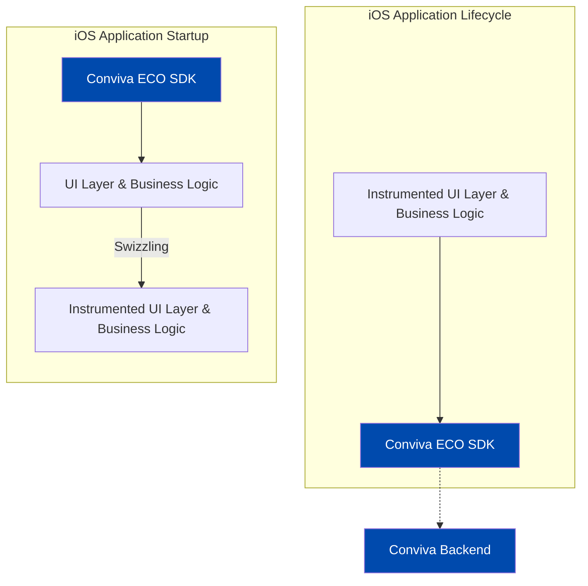

# Conviva iOS ECO SDK

Use Conviva iOS ECO SDK to auto-collect events and track application-specific events and state changes.

**Table of Contents**
- [Quick Start](#quick-start)
- [More Features](#more-features)
- [Auto-collected Events](#auto-collected-events)
- [FAQ](#faq)

## Quick Start

##### Supported Platforms

* iOS(12.0 and above)
* iPadOS(13.0 and above)
* tvOS(12.0 and above)
* watchOS(TBD)

<details>
<summary><b>Diagram</b></summary>



</details>
  

- ### 1. Installation

    - Install the Conviva iOS ECO SDK using one of the following methods:
 
    <!--self-serve[SPM]-->

       - **Swift Package Manager**
           - In **Xcode**, navigate to:  
             `File` → `Add Package Dependency...`
           - Add the following repository URL:  
             `https://github.com/conviva/conviva-ios-appanalytics`


<!--eof-self-serve--> 

<!--self-serve[CocoaPods]-->

   
- #### CocoaPods
- Add the following line to your `Podfile`, replacing `<version>` with the latest version: [](https://github.com/Conviva/conviva-ios-appanalytics/releases)

```plaintext
pod 'ConvivaAppAnalytics', '<version>'
```
<!--eof-self-serve--> 


<!--self-serve[Manual]-->

- #### Manual Install
- Download the package from [](https://github.com/Conviva/conviva-ios-appanalytics/releases).
- In Xcode, go to **Build Phases** and add `ConvivaAppAnalytics.xcframework` to the **Link Binary with Libraries** section. This package contains frameworks for iOS, iPadOS and tvOS.

<!--eof-self-serve--> 
 
    

Only for [Swift Package Manager](#swift-package-manager) and [Manual Install](#manual-install), add required frameworks and linker flags:

<!--self-serve[SPM,Manual]-->


    -  In Xcode, navigate to **Build Phases** &#8594; **Link Binary With Libraries** and add the following system frameworks:
        -  `UIKit`
        -  `Foundation`
        -  `CoreTelephony` (iOS only)
    - In **Other Linker Flags** add `-ObjC`.
      
- Import the Conviva SDK into your source code:
<!-- :::code-tabs[Swift,ObjC] -->
```Swift
// Swift:
import ConvivaAppAnalytics
```

```ObjC
// ObjC:
@import ConvivaAppAnalytics;

```
<!-- ::: -->
<!--eof-self-serve--> 


### 2. Initialization

> **Note:**
> It is recommended to initialize the tracker at the earliest possible stage of the application's launch lifecycle. Ideally, this should be done in the app's entry point method, before any other application functionality is executed.

Some examples of Conviva iOS ECO SDK initialization:
<!-- :::code-tabs[Swift,ObjC] -->
```Swift
// Swift:
import ConvivaAppAnalytics

@UIApplicationMain
class AppDelegate: UIResponder, UIApplicationDelegate {
    
    func application(
        _ application: UIApplication,
        didFinishLaunchingWithOptions launchOptions: [UIApplication.LaunchOptionsKey : Any]? = nil
    ) -> Bool {
        // Initialize Conviva Tracker
        let tracker = CATAppAnalytics.createTracker(customerKey: "YOUR_CUSTOMER_KEY", appName: "YOUR_APP_NAME")

        return true
    }

}
```

```ObjC
// ObjC:
@import ConvivaAppAnalytics;

@implementation AppDelegate

- (BOOL)application:(UIApplication *)application 
    didFinishLaunchingWithOptions:(NSDictionary *)launchOptions {

    // Initialize Conviva Tracker
    id<CATTrackerController> tracker = [CATAppAnalytics createTrackerWithCustomerKey:"YOUR_CUSTOMER_KEY" appName:"YOUR_APP_NAME"];

    return YES;
}
```
<!-- ::: -->
**customerKey** - A string to identify a specific customer account. Use different keys for dev and prod. Find them in [Pulse](https://pulse.conviva.com/app/profile/applications) under My Profile(_Conviva login required_).

**appName** -  A string value that uniquely identifies your app across platforms.

The tracker object can be retrieved using the following API in other classes after initialization.
<!-- :::code-tabs[Swift,ObjC] -->
```Swift
// Swift:
let tracker = CATAppAnalytics.defaultTracker();
```

```ObjC
// ObjC:
id<CATTrackerController> tracker = [CATAppAnalytics defaultTracker];
```
<!-- ::: -->

### 3. Set the User ID
User ID is a unique string identifier to distinguish individual viewers. If using [Conviva Video Sensor](https://github.com/Conviva/ConvivaSDK), match it with the **Viewer ID**.
<!-- :::code-tabs[Swift,ObjC] -->
```Swift
// Swift:
tracker?.subject?.userId = "user_id"
```

```ObjC
// ObjC:
tracker.subject.userId = @"user_id";
```
<!-- ::: -->


After steps 1–3, verify [auto-collected events](#auto-collected-events) in the [validation dashboard](https://pulse.conviva.com/app/appmanager/ecoIntegration/validation). (_Conviva login required_)

## More Features

<details>

<summary><b>Track Custom Event</b></summary>

Two APIs to track custom events:

```
/**
 * Track custom event.
 * @param name Name of the custom event.
 * @param data A JSON-formatted string.
 */
- (void)trackCustomEvent:(NSString *)name data:(nonnull NSString*)data;

/**
 * Track custom event.
 * @param name Name of the custom event.
 * @param eventData Dictionary/Array of dictionaries.
 */
- (void)trackCustomEvent:(NSString *)name eventData:(nonnull id)eventData;
```

Examples: 
<!-- :::code-tabs[Swift,ObjC] -->
```Swift
// Swift:
var eventData = ["identifier1":"test","identifier2":1,"identifier3":true] as [String : Any]
tracker?.trackCustomEvent("your-event-name", eventData: eventData)
```

```ObjC
// ObjC:
NSDictionary *data = @{@"identifier1":@"test",@"identifier2":@(1),@"identifier3":@(true)};
[self trackCustomEvent:@"your-event-name" eventData:data];
```
<!-- ::: -->
</details>

<details>

<summary><b>Set Custom Tags</b></summary>

Custom Tags are global tags applied to all events and persist throughout the application lifespan, or until they are cleared.

Set the custom tags: 
<!-- :::code-tabs[Swift,ObjC] -->
```Swift
// Swift:
// Adds the custom tags
let tags = ["Key1": "Value1", "Key2": "Value2"]
tracker?.setCustomTags(tags)
```

```ObjC
// ObjC:
// Adds the custom tags
NSDictionary* tags = @{
    @"Key1": @"Value1",
    @"Key2": @"Value2",
};
[tracker setCustomTags:tags];
```
<!-- ::: -->
Clear a few of the previously set custom tags:
<!-- :::code-tabs[Swift,ObjC] -->
```Swift
// Swift:
// Clears custom tags Key1, Key2 & Key3
let keys = ["Key1", "Key2", "Key3"]
tracker?.clearCustomTags(keys)
```

```ObjC
// ObjC:
// Clears custom tags Key1, Key2 & Key3
NSArray* keys = @[ @"Key1", @"Key2", @"Key3" ];
[tracker clearCustomTags:keys];
```
<!-- ::: -->
Clear all the previously set custom tags:
<!-- :::code-tabs[Swift,ObjC] -->
```Swift
// Swift:
// Clears all the custom tags
tracker?.clearAllCustomTags()
```

```ObjC
// ObjC:
// Clears all the custom tags
[tracker clearAllCustomTags];
```
<!-- ::: -->
</details>

<details>

<summary><b>Override UIViewController Class Name</b></summary>

By default, user navigation is tracked using the class names of `UIViewController` instances. 
Override the screen name using the following API:
<!-- :::code-tabs[Swift,ObjC] -->
```Swift
// Swift:
class ExampleViewController: UIViewController {

    // Add below property in view controller
    @objc var catViewId: String = "Home Screen View"

}

```
```ObjC
// ObjC:
// CustomViewController.h
@interface ExampleViewController : UIViewController
    // Declare property like 
    @property(copy, nonatomic)NSString *catViewId;

@end

// CustomViewController.m
#import "ExampleViewController.h"

@implementation ExampleViewController

- (void)viewDidLoad {
    [super viewDidLoad];

    self.catViewId = @"Home Screen View";
    // ...
}

@end
```
<!-- ::: -->
</details>

<details>

   <summary><b>SwiftUI Support</b></summary>

   For SwiftUI, `button_click` and `screen_view` events are not auto-collected and Conviva provide the extension functions. 

   In SwiftUI applications, `button_click` and `screen_view` events are not auto-collected. To enable tracking for these events, Conviva provides extension functions: 

   To track user taps or clicks:  
  
   ```
   Button("Submit") {
       // action
   }.convivaAnalyticsButtonClick(title: "Submit") 
   ```


   To track when a new screen or view is displayed:
   
   ```
   struct DetailView: View {
      var body: some View {
         VStack {
            Text("Item Detail")
         }
         .convivaAnalyticsScreenView(name: "Detail Screen")
     }
  }
   ```
  
   
</details>

## Auto-collected Events

Conviva automatically collects rich set of app performance metrics through app events after completing the [Quick Start](#quick-start).

<details>
  <summary><b>Auto-collected events table</b></summary>


Event | Occurrence |
------|-------------|
network_request | After receiving the network request response. [Refer limitations](#limitations).|
screen_view | When the screen is interacted on either first launch or relaunch. [Refer limitations](#limitations).|
application_error | When an error occurrs in the application. |
button_click | On the button click callback. [Refer limitations](#limitations).|
application_background | When the application is taken to the background. |
application_foreground | When the application is taken to the foreground. |
application_install | When the application is launched for the first time after it's installed. (It's not the exact installed time.) |

To learn about the default metrics for analyzing the native and web applications performance, such as App Crashes, Avg Screen Load Time, and Page Loads, refer to the [App Experience Metrics](https://pulse.conviva.com/learning-center/content/eco/eco_metrics.html) page in the Learning Center.

</details>

### Limitations
<details>
   
   <summary><b>network_request</b></summary>

1. This feature supports `NSURLSession`, `NSURLConnection`, and third-party network libraries built on top of `NSURLSession` or `NSURLConnection`.

    **Request and Response Body Collection:**

   Collected only when:
   - Size is < 10KB and content-length is available.
   - Content-type is `"json"` or `"text/plain"`.
   - Data is a `NSDictionary`, nested `NSDictionary`, or `NSArray`.

    **Request and Response Header Collection:**

    Collected only when:
    - Data is a `NSDictionary` (Nested `NSDictionary` and `NSArray` are not yet supported).

2. Auto-collection of network requests made by the default `AVPlayer` implementation is **not supported**.
      
</details>

<details>

   <summary><b>screen_view, button_click</b></summary>
   
   Auto-collection of `screen_view` and `button_click` is not supported for SwiftUI. To report `screen_view` and `button_click` in SwiftUI, please refer to `"SwiftUI Support"` under the [More Features](#more-features).
   
</details>

## FAQ

[ECO Integration FAQ](https://pulse.conviva.com/learning-center/content/sensor_developer_center/tools/eco_integration/eco_integration_faq.htm)
